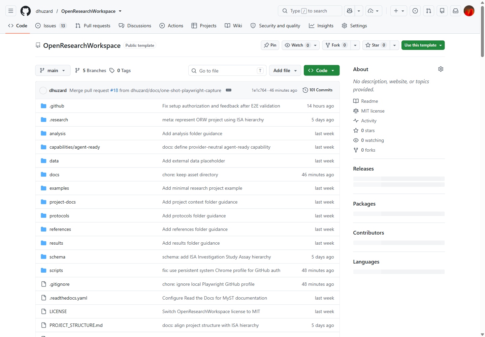
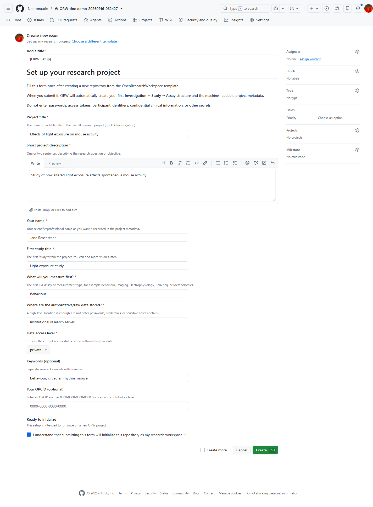
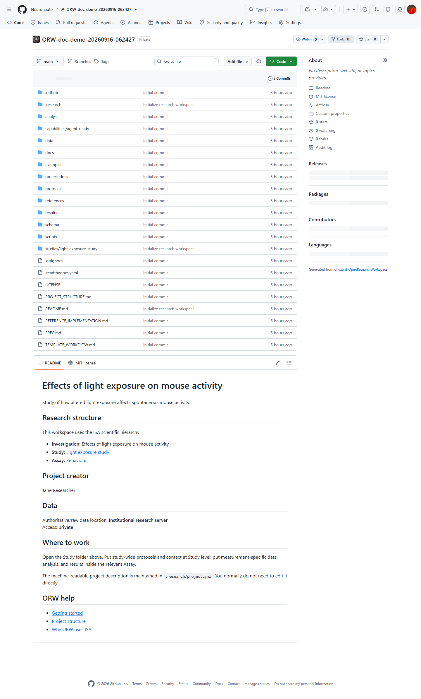

# OpenResearchWorkspace

**A portable research workspace specification with GitHub as one supported reference implementation.**

OpenResearchWorkspace (ORW) defines a portable format/contract for research workspaces that are **human usable, FAIR-oriented, machine readable, reproducible, and agent ready**.

ORW is **forge-agnostic by design**. A valid workspace does not require GitHub, GitLab, Git, or any central ORW service.

The current implemented beginner path uses the GitHub template:

> **Use template → set up project → collaborate → work → publish**

That path remains supported, but GitHub is an adapter rather than part of the scientific format. The next portable implementations are a small local CLI and a browser generator that can create the same workspace without a forge account.

Ordinary researchers should not need to learn Git, YAML, CI/CD, branches, tags, or GitHub Actions to use the workspace.

## New project? Set it up here

If you are reading this README **inside a new repository that you just created from the ORW template**, use the setup form below:

### [→ Set up my research project](../../issues/new?template=orw-setup.yml)

The form asks for your project title, first Study, first measurement/Assay, data location, and a few optional metadata fields. After you submit it, ORW initializes the workspace automatically and replies when it is ready.

You do **not** need to open GitHub Actions, run code, install Git, or edit YAML.

> GitHub calls the setup form an **issue** and may label the final button **Create** or **Submit new issue**. In ORW this simply means sending the project setup form. It is closed automatically after successful initialization.

If you are viewing the **OpenResearchWorkspace development repository itself**, do not submit the setup form here. First use **Use this template** to create your own repository.

## ORW uses the ISA Investigation–Study–Assay model

ORW adopts **ISA (Investigation, Study, Assay)** as the scientific organizational backbone rather than inventing a new experiment hierarchy.

ISA is an established metadata framework for life-science, environmental and biomedical experiments. Its three levels map naturally onto research practice:

- **Investigation** — the overall research project/context: objectives, people, publications and the studies that belong together.
- **Study** — a unit of research describing subjects/sources, study design, factors, treatments and protocols.
- **Assay** — a measurement or test performed on study material or subjects, including measurement/technology type, processing provenance and links to resulting data.

This matters for ORW because ISA already provides semantics for the relationships that ORW would otherwise have to invent: project → study → measurement, subjects/samples → processes → data, protocols, factors, technologies and ontology annotations. ISA also has established ISA-Tab and ISA-JSON serializations and an existing tooling ecosystem.

ORW therefore **uses ISA semantics as the scientific backbone while keeping the beginner interface simpler than ISA itself**. Researchers should see understandable project/study/measurement concepts and forms; ORW infrastructure can generate or interoperate with ISA-compatible representations behind the scenes.

ORW does not equate a GitHub repository with an ISA Assay. The repository is the workspace/container. In the normal case, one ORW workspace represents one **Investigation**, containing one or more **Studies**, each containing one or more **Assays**.

See [`docs/isa.md`](docs/isa.md) for the rationale and mapping.

## Start here

If you are a researcher, begin with the step-by-step guide in [`docs/getting-started.md`](docs/getting-started.md) and the project skeleton in [`docs/project-structure.md`](docs/project-structure.md).

### Visual walkthrough

[▶ Watch the annotated setup walkthrough (WebM)](docs/assets/getting-started/orw-getting-started.webm)

The recording provides numbered instructions and highlights each GitHub control before it is used.

| Create a project from the template | Complete the guided setup form |
| --- | --- |
|  |  |



If you want to understand the architecture, read [`docs/concepts.md`](docs/concepts.md), [`docs/isa.md`](docs/isa.md), and [`SPEC.md`](SPEC.md).

## What ORW is

ORW has two distinct layers:

1. **Specification / contract** — defines what an ORW-compatible research workspace must expose and how core concepts are represented.
2. **Reference implementations** — practical ways to create or emit a conforming workspace.

The primary reference implementation is this GitHub template. Other software can produce ORW-compatible workspaces without using the template.

## Portable implementation architecture

ORW separates the scientific contract from the interface used to create a workspace:

```text
                    ORW specification
                           │
                           ▼
              canonical generation contract
                           │
              ┌────────────┼────────────┐
              ▼            ▼            ▼
           ORW CLI    Browser generator  Forge adapter
              │            │            │
              └────────────┼────────────┘
                           ▼
                    ORW workspace
                           │
                           ▼
                  interoperability export
                           │
                           ▼
                       RO-Crate
```

The canonical scientific record remains `.research/project.yml`. GitHub-specific automation must not become a separate scientific implementation.

- [Portable CLI/browser architecture](docs/portable-implementations.md)
- [RO-Crate interoperability and export](docs/ro-crate.md)

The browser generator is planned as a static, local-first interface: fill the scientific form, preview the ISA structure, and download a workspace ZIP without requiring a Git provider account or server-side persistence. The CLI is planned around `orw init`, `orw validate`, and `orw export --format ro-crate`.

## Researcher-facing workflow

```text
Use this template
      ↓
Create my research repository (Investigation)
      ↓
Click “Set up my research project”
      ↓
Fill a short form
      ↓
ORW initializes automatically
      ↓
First Study + first Assay are created
      ↓
Collaborate and work
      ↓
Publish when ready
```

A very simple project can start with one Investigation, one Study and one Assay. Complexity is added only when the science requires it.

## Default scientific project skeleton

```text
my-research-project/                 # Investigation workspace
├── README.md
├── studies/
│   └── study-01/
│       ├── README.md
│       ├── data/
│       │   ├── raw/
│       │   ├── processed/
│       │   └── external/
│       ├── assays/
│       │   └── assay-01/
│       ├── analysis/
│       ├── results/
│       └── protocols/
├── references/
├── project-docs/
├── .research/
└── .github/
```

The hierarchy follows ISA: the workspace represents an Investigation; `studies/` contains its research units; `assays/` contains measurements/tests belonging to a Study. Analysis and results remain close to the Study they interpret, while Investigation-wide references and project documentation remain at the root.

See [`PROJECT_STRUCTURE.md`](PROJECT_STRUCTURE.md) for the normative definition.

## Core design principles

Every ORW-compatible workspace should be:

- **Human usable** — understandable without learning repository internals.
- **FAIR-oriented** — metadata, identifiers, and licensing are captured during the project rather than reconstructed only at publication.
- **Machine readable** — one canonical structured project description with ISA-aligned scientific semantics.
- **Reproducible** — subjects/samples, processes, assays, data, analyses and outputs can be related through provenance.
- **Agent ready** — AI systems can discover project context without reverse-engineering filenames or repository history.
- **Interoperable rather than bespoke** — ORW reuses ISA for experimental structure instead of defining a competing Investigation/Study/Assay model.

## Canonical machine-readable files

```text
.research/project.yml       canonical ORW project record, ISA-aligned
.research/workspace.yml     ORW implementation/version state
.research/capabilities.yml  optional capability activation
.research/layout.yml        folder roles and ISA/provenance semantics
.research/profiles.yml      initialization presets
```

Normal researchers should not need to edit these files directly. ISA-JSON and ISA-Tab should be treated as interoperable representations/exports rather than additional metadata that scientists must maintain manually.

## Project profiles

ORW uses one standard and one template, with initialization presets rather than separate template families. Profiles may simplify which folders are initially shown, but they must preserve the ISA hierarchy when experimental Studies and Assays exist.

## Repository contents

- [`PROJECT_STRUCTURE.md`](PROJECT_STRUCTURE.md) — canonical ISA-aligned scientific project skeleton.
- [`docs/project-structure.md`](docs/project-structure.md) — researcher-facing explanation of the skeleton.
- [`docs/isa.md`](docs/isa.md) — why ORW adopts ISA and how the mapping works.
- [`docs/getting-started.md`](docs/getting-started.md) — step-by-step researcher guide.
- [`docs/concepts.md`](docs/concepts.md) — ORW concepts and architecture.
- [`docs/capabilities.md`](docs/capabilities.md) — FAIR, reproducibility, AI-ready, and agent-ready capability model.
- [`docs/faq.md`](docs/faq.md) — practical FAQ.
- [`SPEC.md`](SPEC.md) — Research Workspace Core v0.1 draft specification.
- [`schema/project.schema.json`](schema/project.schema.json) — machine-readable project schema.

## Roadmap

**v0 — ISA-aligned workspace + current GitHub adapter:** create Investigation, beginner setup form, add Studies/Assays, collaboration, files/data references, metadata, publish/DOI.

**v0.x — Portable creation layer:** extract the provider-neutral generator, add `orw init` / `orw validate`, and add a static browser generator that downloads a conforming workspace ZIP.

**v1 — FAIR + interoperability:** richer metadata, ontology annotations, ISA-JSON/ISA-Tab interoperability, persistent identifiers, DataCite export, validated RO-Crate 1.3 export, FAIR Signposting.

**v2 — Reproducible workspace:** ISA process/provenance links plus environments, workflows and automated QA.

**v3 — AI-ready workspace:** semantic project context, ISA-aligned entities, schemas, ontology mappings and explicit policies.

**v4 — Agentic workspace:** reusable provider-neutral skills plus thin agent adapters operating against the same project model.

## Non-goals

ORW is not intended to become a required central hosted application, require scientists to fork the ORW development repository, replace repositories designed for large scientific datasets, store sensitive research data on GitHub by default, prescribe a single archival or AI provider, or create a competing experimental metadata hierarchy where an established standard already exists.

## Status

Early specification with a working GitHub-template adapter. **ISA Investigation–Study–Assay is the required scientific organizational model.** The current beginner initialization path is a GitHub setup form; provider-neutral CLI and browser creation paths are planned so that GitHub is optional infrastructure rather than a requirement.

## License

**OpenResearchWorkspace itself is MIT licensed.** This applies to the ORW software, template infrastructure, and reusable scaffolding in this repository; see [`LICENSE`](LICENSE).

Scientific projects created from the ORW template are independent projects and do **not** automatically inherit MIT for their research outputs.
